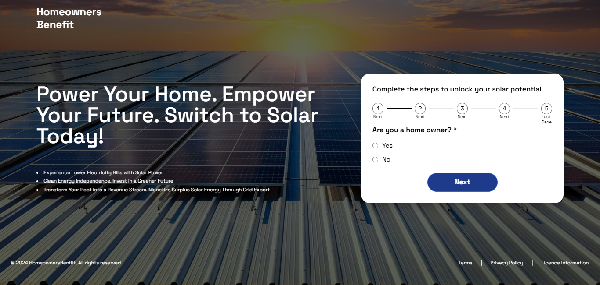

# React Vite App

[](https://nebs-it-trial.vercel.app/)

This is a **React** + **TypeScript** + **Tailwind** application bootstrapped with **Vite**, craeted for nebs-it selection process.



## Table of Contents

- [Prerequisites](#prerequisites)
- [Installation](#installation)
- [Development](#development)
- [Build](#build)
- [Scripts](#scripts)
- [Directory Structure](#directory-structure)
- [License](#license)

## Prerequisites

Before you begin, ensure that you have met the following requirements:

- **Node.js** (version 14.0 or higher)
- **npm** (node package manager) or **yarn** (optional)

You can download Node.js from [here](https://nodejs.org/).

## Installation

1. Clone the repository:

    ```bash
    git clone https://github.com/AB498/nebs-it-trial.git
    ```

2. Navigate to the project directory:

    ```bash
    cd nebs-it-trial
    ```

3. Install dependencies:

    If you're using npm:

    ```bash
    npm install
    ```

    Or, if you're using yarn:

    ```bash
    yarn install
    ```

## Development

To start the development server and begin working on the app, run:

```bash
npm run dev
```

Or, if using yarn:

```bash
yarn dev
```

This will start the app on [http://localhost:3000](http://localhost:3000) (default Vite port) in development mode.

## Build

To build the app for production, run:

```bash
npm run build
```

Or, if using yarn:

```bash
yarn build
```

This will create a production-ready build in the `dist/` directory.

## Scripts

- `npm run dev` or `yarn dev`: Starts the development server with hot reloading.
- `npm run build` or `yarn build`: Bundles the app for production.
- `npm run preview` or `yarn preview`: Serves the production build for previewing.

## Directory Structure

```
my-react-vite-app/
├── public/              # Static files like index.html, favicon, etc.
├── src/                 # Application source code
│   ├── assets/          # Images, styles, etc.
│   ├── components/      # Reusable UI components
│   ├── App.tsx          # Main app component
│   ├── main.tsx         # Entry point for React app
│   └── index.css        # Global styles (CSS/SCSS)
├── .gitignore           # Git ignore rules
├── package.json         # Project dependencies and scripts
└── vite.config.ts       # Vite configuration file
```

## Live

Deployed with Vercel at https://nebs-it-trial.vercel.app

## License

This project is licensed under the MIT License - see the [LICENSE](LICENSE) file for details.
